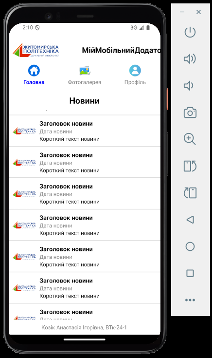
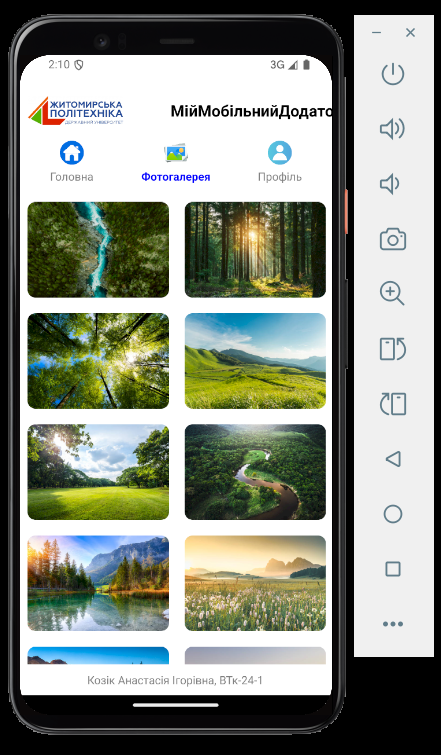
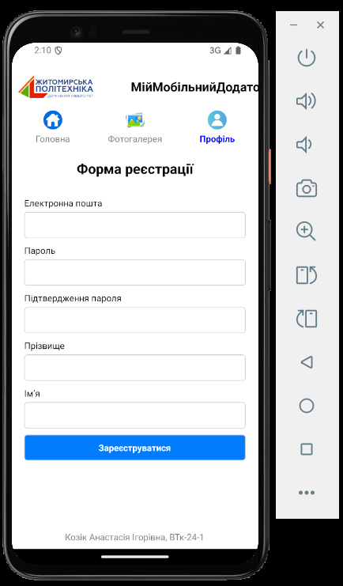

# МійМобільнийДодаток

Цей проект — мобільний додаток, створений за допомогою React Native. Додаток має три основні екрани: новини, фотогалерею та форму реєстрації користувача. Це простий і зручний додаток для перегляду новин, фото та реєстрації нового користувача.

## Опис

Мобільний додаток реалізує такі функції:
- **Новини**: відображення списку новин з коротким описом, датою та зображенням.
- **Фотогалерея**: відображення колекції фотографій.
- **Реєстрація**: форма для реєстрації користувача, що включає введення електронної пошти, паролю та імені.

## Вимоги до запуску

Для запуску додатка вам потрібно мати:
- **Node.js** — для керування пакетами та запуску React Native.
- **React Native CLI** — для побудови та запуску додатка.
- **Android Studio** (для Android) або **Xcode** (для iOS) — для запуску додатка на емуляторі або реальному пристрої.


## Необхідні імпорти

Для цього проекту необхідно імпортувати наступні бібліотеки:

```js
import React, { Component } from "react";
import { View, Text, FlatList, Image, StyleSheet, TouchableOpacity, TextInput } from "react-native";
import { NavigationContainer } from "@react-navigation/native";
import { createStackNavigator } from "@react-navigation/stack";
```





## Автор

- **Козік Анастасія Ігорівна**, студентка групи ВТк-24-1.
